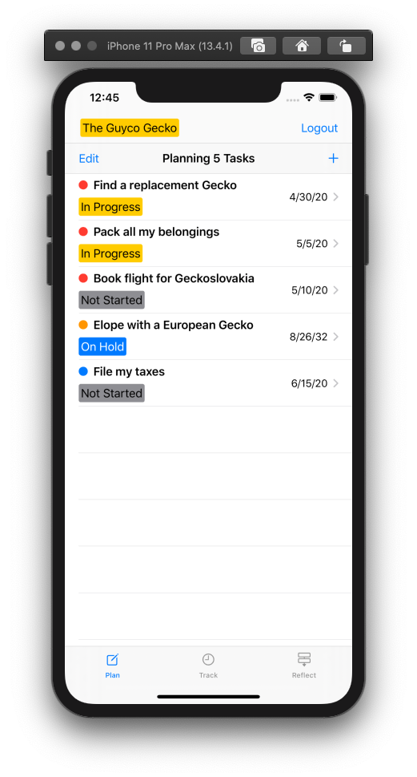
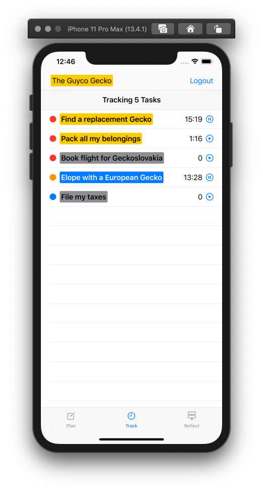
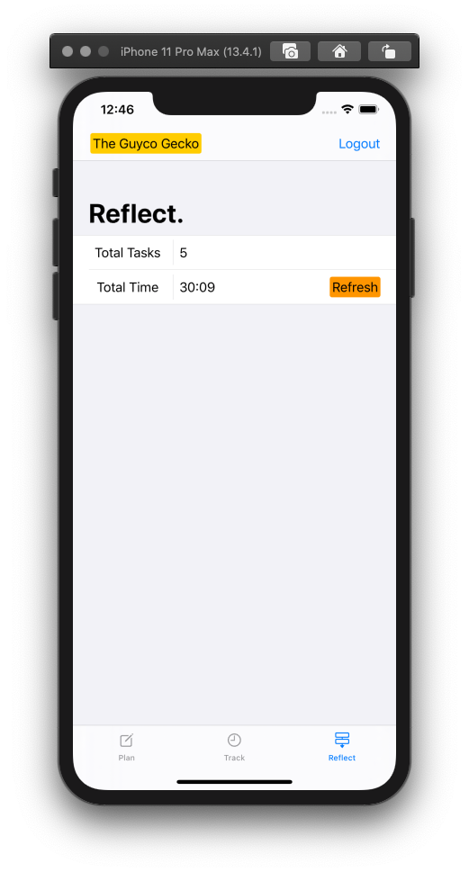
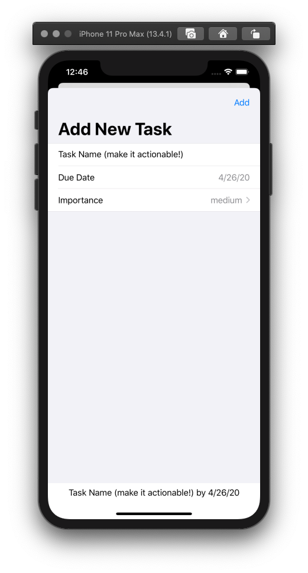
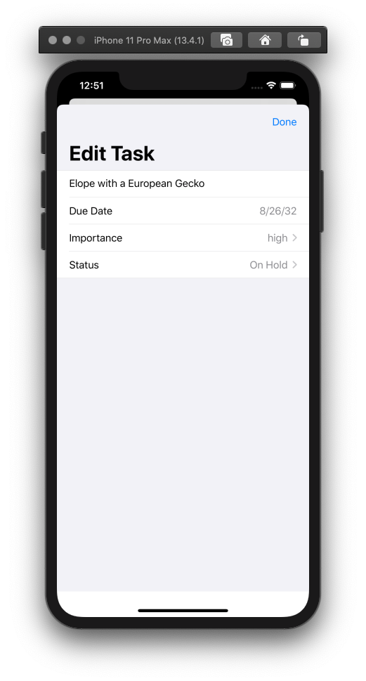
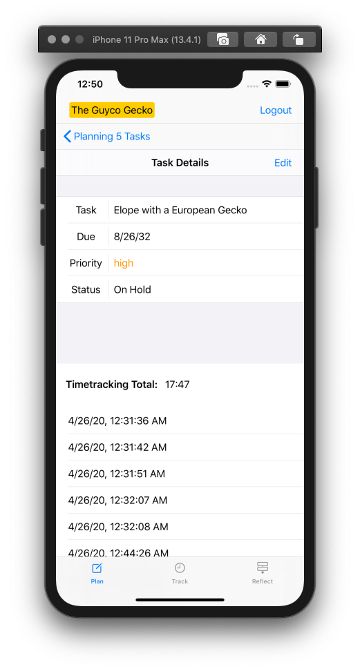

# ProducTime ⏱

CIS195-201 Final Project (PennKey: AndrewYu)

 My first project in SwiftUI! A to-do list app built in that tracks how long it takes you to complete a task. Just tap the play button on an app to start tracking.
 You can add new tasks, set priority levels, and log when you start and stop working on the task. 

## Components Used 🛠
- Firebase Auth
- Firebase Realtime Database

## Instructions for Running the Project 📝
- Open the ProducTime.xcworkspace file and run!

## Current Functionality 💪
* Handles different users via email login / logout / signup
* User can create and edit tasks with due dates (future dates only!) and priority levels
* Log when User is working on a given task and when they stop
* See how much time a User has spent working on tasks and in total

### Other Features 😎
* Project colors change depending on importance level and status
* Users can edit their display name

## Future Features to Implement 🔬
- Enable task deletion
- Make timetracking logs editable
- Add an "estimated time left" property to tasks
- Enable task sorting by status, importance, time spent, estimated time left
- Integration with Google Calendar for some super secret special features 🤫

## Bugs to Fix 🕷
- Figure out how to update PlanRowViews automatically when its respective task is updated

## Screenshots 📷
  
  
